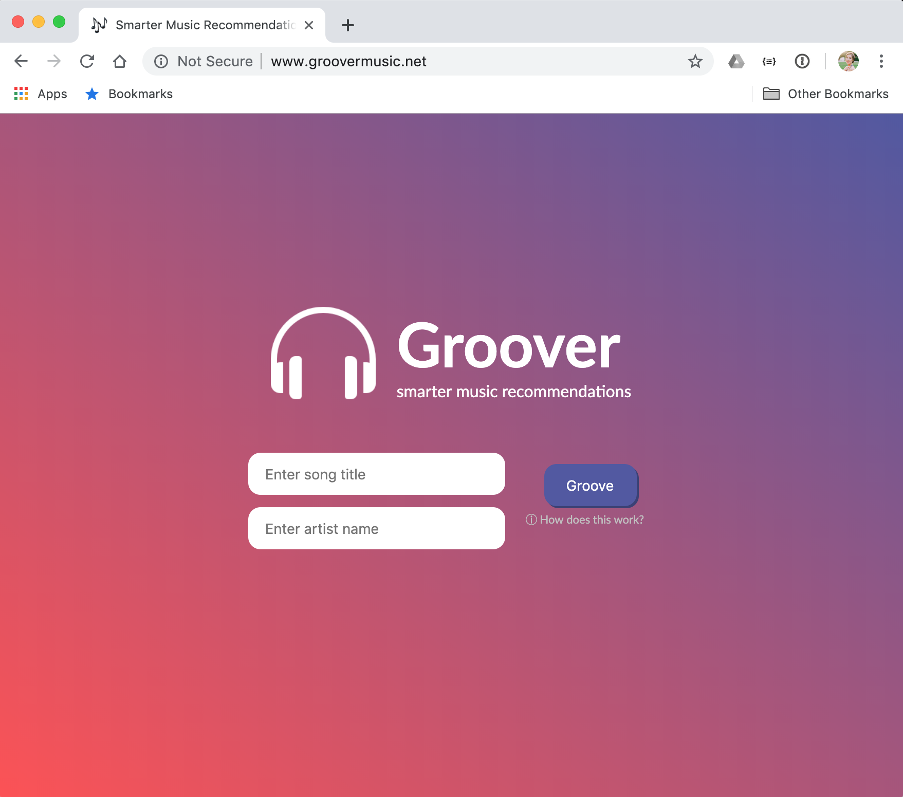

This page contains information and demos for my various projects.

## Major Projects
### Groover Web App
{:height="400" width="400"} 

**Project Info:** Groover is a web app that generate music recommendations based on your favorite song's lyrical content. This project was developed during "CS121: Software Development" at Harvey Mudd College in Spring 2019. \\
**To watch a demo:** [click here](https://sienaguerrero.com/downloads/Groover-Demo.mp4) \\
**To visit the Github repo:** [click here](https://github.com/sienaguerrero/groover) \\
**To see it in action:** [click here](http://www.groovermusic.net/) *note: site may take a while to load on first launch* \\
**To read our Final Report:** [click here](https://sienaguerrero.com/downloads/Groover-FinalReport.pdf) 

### Harvey Mudd Wellness Greenhouse
 at Mudd Greenhouse opening with Harvey Mudd College's Dean Michelle"){:height="400" width="400"} 

**Project Info:** The Mudd Wellness Greenhouse, or "Mudd Greenhouse" is a space on campus to provide students access to tools, supplies, and storage for all gardening-related activities. I helped design and raised money ($2500) to build this community greenhouse, oversaw construction and set-up of the space including purchasing supplies, and stocked interior with furnishings including gardening tools, chairs, shelves, gardening books, and a potting station. \\
<!---**To visit the Facebook page:** [click here](https://www.facebook.com/muddgreenhouse/)--->

### Cuarenta Java App
**Project Info:** Java program based on the card game "Cuarenta" (the national card game of Ecuador). \\
\**Currently in development.* \\
**To visit the Github repo:** [click here](https://github.com/sienaguerrero/cuarenta)

## Minor Projects
### Climate Change Data Visualization Site
**Project Info:** Climate change data visualization website made using graphs from Bokeh, an interactive visualization library for Python. This project was developed as part of a group final project during "CS35: Computer Science for Insight" at Harvey Mudd College in Spring 2017. \\
**To visit the Github repo:** [click here](https://github.com/sienaguerrero/cs35-final-project)

## Academic Writing
### Brain-Computer Interfaces Paper
**Project Info:** A formal research paper for a machine learning group project on brain-computer interfaces conducted during Spring 2019. This project centers around further analysis using data from "Decoding auditory attention to instruments in polyphonic music using single-trial EEG conducted by  classification," a research paper written by a research group based at Berlin's Technische Universität. \\
**To read the paper:** [click here](https://sienaguerrero.com/downloads/BCI-music-attention-paper.pdf) \\
**To read the original research team's paper:** [click here](https://www.ncbi.nlm.nih.gov/pubmed/24608228)

### Human Data Science Ethics Paper
**Project Info:** A policy memo on socially-assistive robots detailing core issues, moral approaches, current contexts, and recommendations for future use of this technology. Written at the end of Fall 2018. \\
**To read the paper:** [click here](https://sienaguerrero.com/downloads/HDSE-policy-memo-social-robots.pdf)

<!---
### Science, Technology, and Society Paper
**Project Info:** A reflection paper on trash innovation, and hope during the Anthropocene entitled: "Trash, Hope, and the Anthropocene". \\
**To read the paper:** [click here](https://sienaguerrero.com/downloads/sts-reflection-trash-hope.pdf)
--->
